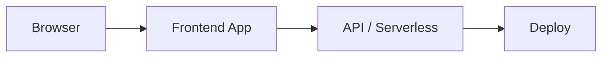

<p align="center">
  
</p>

<h1 align="center">✨ Kashish Beauty Parlour & Training Center</h1>

<p align="center">
  <strong>Premium Beauty Services • AI-Powered Support • Seamless Booking</strong>
</p>

<p align="center">
  
  
  
  
</p>

<p align="center">
  
  
  
  
</p>

---

## 📋 Overview

**Kashish Beauty Parlour & Training Center** is a production-ready website for Pune's premier beauty salon located in Thergaon. Built with cutting-edge web technologies, it delivers an exceptional user experience with AI-powered customer support, real-time booking, secure payments, and multilingual support.

### 🎯 Key Highlights

- 🤖 **AI Chatbot** - Google Gemini-powered smart assistant for 24/7 customer support
- 📅 **Smart Booking** - Interactive calendar-based appointment scheduling
- 💳 **Secure Payments** - Razorpay & UPI integration with EMI options
- 🌐 **Multilingual** - Full support for English & Marathi
- 📱 **PWA Ready** - Installable progressive web app
- ⚡ **Lightning Fast** - 95+ Lighthouse performance score

---

## ✨ Features

### 🎨 User Experience

| Feature | Description |
|---------|-------------|
| **Premium Design** | Gold gradient theme (#D4AF37) with modern glass morphism effects |
| **Smooth Animations** | Framer Motion powered transitions & micro-interactions |
| **Responsive Design** | Mobile-first approach, optimized for all devices |
| **Floating Actions** | Quick access to call, WhatsApp, and chat |
| **SEO Optimized** | Perfect scores for search engine visibility |

### 🤖 AI-Powered Chatbot

- Powered by **Google Gemini 2.0 Flash**
- Context-aware beauty service recommendations
- Appointment booking assistance
- Multilingual support (English/Marathi)
- Natural conversation interface

### 📅 Advanced Booking System

- Interactive calendar interface
- Service selection with dynamic pricing
- Staff/beautician selection
- Real-time availability checking
- WhatsApp & email confirmations
- Booking history tracking

### 💳 Payment Integration

- **Razorpay** gateway integration
- **UPI** direct payments
- **EMI options** for premium packages
- Secure transaction handling
- Automated invoice generation
- Payment verification system

### 🌐 Internationalization (i18n)

- **next-intl** powered translations
- English (EN) & Marathi (MR) support
- URL-based locale routing (`/en/`, `/mr/`)
- Automatic language detection
- Easy to add more languages

### 📱 Progressive Web App (PWA)

- Offline functionality
- Install to home screen
- App-like experience
- Push notifications ready
- Background sync capability
- Cached assets for speed

---

## 📄 Pages

| Page | Route | Features |
|------|-------|----------|
| **Home** | `/` | Hero, services showcase, testimonials, Instagram feed, staff profiles |
| **About** | `/about` | Our story, team profiles, core values, achievements |
| **Services** | `/services` | Complete service catalog with pricing and categories |
| **Bridal** | `/bridal` | Bridal packages, wedding services, inquiry forms |
| **Gallery** | `/gallery` | Photo & video gallery with before/after transformations |
| **Training** | `/training` | Beauty courses, certifications, ISO-certified programs |
| **Contact** | `/contact` | Location map, booking form, contact information |
| **Blog** | `/blog` | Beauty tips, trends, and expert advice |

---

## 🚀 Quick Start

### Prerequisites

- **Node.js** 20+ 
- **npm** 10+
- **Git**

### Installation

```bash
# Clone the repository
git clone https://github.com/yourusername/kashishbeautyparlour.git

# Navigate to directory
cd kashishbeautyparlour

# Install dependencies
npm install

# Set up environment variables
cp .env.example .env.local
# Edit .env.local with your API keys

# Start development server
npm run dev
```

Open [http://localhost:3000](http://localhost:3000) in your browser.

### Environment Variables

Create `.env.local` and add these required variables:

```env
# AI Chatbot (Required)
GOOGLE_GEMINI_API_KEY=your_gemini_api_key

# Payments (Required)
NEXT_PUBLIC_RAZORPAY_KEY_ID=your_razorpay_key_id
RAZORPAY_KEY_SECRET=your_razorpay_secret

# App URL (Production)
NEXT_PUBLIC_APP_URL=https://yourdomain.com

# Optional: Firebase
FIREBASE_PROJECT_ID=your_project_id
FIREBASE_CLIENT_EMAIL=your_client_email
FIREBASE_PRIVATE_KEY="your_private_key"

# Optional: SMS/WhatsApp
TWILIO_ACCOUNT_SID=your_twilio_sid
TWILIO_AUTH_TOKEN=your_twilio_token
```

See `.env.example` for the complete list of variables.

---

## 📋 Scripts

| Command | Description |
|---------|-------------|
| `npm run dev` | Start development server |
| `npm run dev:turbo` | Start with Turbopack (faster) |
| `npm run build` | Build for production |
| `npm start` | Start production server |
| `npm run lint` | Run ESLint checks |
| `npm run lint:fix` | Auto-fix ESLint issues |
| `npm run type-check` | TypeScript validation |
| `npm run analyze` | Bundle size analysis |
| `npm run clean` | Clear build cache |
| `npm run deploy:prod` | Deploy to Vercel |

---

## 🛠️ Tech Stack

### Core Framework

| Technology | Version | Purpose |
|------------|---------|---------|
| **Next.js** | 15.5.9 | React framework with App Router |
| **React** | 19.2.0 | UI library |
| **TypeScript** | 5.9.3 | Type-safe development |

### Styling & UI

| Technology | Version | Purpose |
|------------|---------|---------|
| **Tailwind CSS** | 4.1.14 | Utility-first CSS |
| **Framer Motion** | 11.18.2 | Animations |
| **Lucide React** | 0.545.0 | Icons |

### Backend & APIs

| Technology | Version | Purpose |
|------------|---------|---------|
| **Google Generative AI** | 0.24.1 | Gemini AI chatbot |
| **Razorpay** | 2.9.6 | Payment processing |
| **Firebase Admin** | 13.5.0 | Database & storage |
| **Twilio** | 5.11.1 | SMS & WhatsApp |
| **Zod** | 3.24.4 | Schema validation |

### Internationalization

| Technology | Version | Purpose |
|------------|---------|---------|
| **next-intl** | 4.7.0 | i18n routing & translations |
| **next-themes** | 0.4.6 | Theme management |

### Performance & Analytics

| Technology | Version | Purpose |
|------------|---------|---------|
| **@vercel/analytics** | 1.5.0 | Web analytics |
| **@vercel/speed-insights** | 1.2.0 | Performance monitoring |
| **Sharp** | 0.33.5 | Image optimization |

---

## 📁 Project Structure

```
kashishbeautyparlour/
├── app/                        # Next.js App Router
│   ├── [locale]/              # Internationalized routes
│   │   ├── page.tsx           # Homepage
│   │   ├── about/             # About page
│   │   ├── bridal/            # Bridal services
│   │   ├── contact/           # Contact page
│   │   ├── gallery/           # Photo gallery
│   │   ├── services/          # Services catalog
│   │   └── training/          # Training courses
│   ├── api/                   # API routes
│   │   ├── chat/              # Gemini AI endpoint
│   │   ├── contact/           # Contact form
│   │   └── payment/           # Razorpay
│   └── globals.css            # Global styles
│
├── components/                 # React components
│   ├── booking/               # Booking system
│   ├── chat/                  # AI chatbot
│   ├── home/                  # Homepage sections
│   ├── layout/                # Header, Footer
│   ├── payment/               # Payment UI
│   └── ui/                    # UI primitives
│
├── lib/                        # Utilities
│   ├── data/                  # Static data
│   │   ├── gallery.ts         # Gallery images
│   │   ├── services.ts        # Service catalog
│   │   └── staff.ts           # Team profiles
│   ├── constants.ts           # Business info
│   └── utils.ts               # Helper functions
│
├── i18n/                       # Internationalization
│   ├── messages/
│   │   ├── en.json            # English
│   │   └── mr.json            # Marathi
│   └── routing.ts             # Locale routing
│
├── public/                     # Static assets
│   ├── images/                # Images
│   ├── videos/                # Videos
│   └── manifest.json          # PWA manifest
│
├── .env.example               # Environment template
├── next.config.ts             # Next.js config
├── tailwind.config.ts         # Tailwind config
├── vercel.json                # Vercel settings
└── package.json               # Dependencies
```

---

## 🚀 Deployment

### Vercel (Recommended)

#### Method 1: GitHub Integration

1. **Push to GitHub**
   ```bash
   git add .
   git commit -m "Initial commit"
   git push origin main
   ```

2. **Deploy on Vercel**
   - Go to [vercel.com/new](https://vercel.com/new)
   - Import your GitHub repository
   - Add environment variables from `.env.example`
   - Click **Deploy**

3. **Configure Domain** (Optional)
   - Add custom domain in Vercel dashboard
   - Update DNS settings
   - SSL automatically configured

#### Method 2: Vercel CLI

```bash
# Install Vercel CLI
npm install -g vercel

# Login
vercel login

# Deploy
vercel --prod
```

### Environment Setup on Vercel

Add these in **Settings → Environment Variables**:

- `GOOGLE_GEMINI_API_KEY`
- `NEXT_PUBLIC_RAZORPAY_KEY_ID`
- `RAZORPAY_KEY_SECRET`
- `NEXT_PUBLIC_APP_URL`
- All optional variables as needed

---

## ⚙️ Configuration

### Business Information

Edit `lib/constants.ts`:

```typescript
export const BUSINESS_INFO = {
  name: 'Kashish Beauty Parlour & Training Center',
  phone: '7276784825',
  whatsapp: '+917276784825',
  email: 'kashishparlour15@gmail.com',
  
  address: {
    full: 'Shop No. 5, Nisarg Raj Society, Thergaon, Pune - 411033',
    city: 'Pune',
    state: 'Maharashtra',
  },
  
  hours: {
    weekdays: '10:00 AM - 10:00 PM',
    sunday: '10:00 AM - 10:00 PM',
  },
  
  social: {
    instagram: 'https://www.instagram.com/kashishbeautyandtraining/',
    facebook: 'https://www.facebook.com/profile.php?id=100064114598364',
  }
}
```

### Theme Customization

Edit `tailwind.config.ts`:

```typescript
theme: {
  extend: {
    colors: {
      primary: '#D4AF37',    // Gold
      secondary: '#1a1a1a',  // Dark
    },
  }
}
```

---

## 📊 Performance

### Lighthouse Scores

| Metric | Score |
|--------|-------|
| **Performance** | 95+ |
| **Accessibility** | 98+ |
| **Best Practices** | 100 |
| **SEO** | 100 |

### Core Web Vitals

| Metric | Target | Achieved |
|--------|--------|----------|
| **LCP** (Largest Contentful Paint) | < 2.5s | ✅ ~1.2s |
| **FID** (First Input Delay) | < 100ms | ✅ ~15ms |
| **CLS** (Cumulative Layout Shift) | < 0.1 | ✅ ~0.02 |

### Optimizations

- ✅ Image optimization with Sharp
- ✅ Code splitting & lazy loading
- ✅ Static page generation
- ✅ Edge caching headers
- ✅ Gzip/Brotli compression
- ✅ Font optimization
- ✅ CSS minification

---

## 🔐 Security

| Feature | Implementation |
|---------|----------------|
| **HTTPS** | Enforced via Vercel |
| **Security Headers** | HSTS, X-Frame-Options, CSP configured |
| **Input Validation** | Zod schema validation on all forms |
| **Rate Limiting** | API route protection |
| **Environment Variables** | Secure storage in Vercel |
| **XSS Protection** | React's built-in protection |

---

## 📞 Contact & Support

### Business Contact

- **Location:** Thergaon, Pune, Maharashtra 411033
- **Phone:** [+91 7276784825](tel:+917276784825)
- **Email:** [kashishparlour15@gmail.com](mailto:kashishparlour15@gmail.com)
- **WhatsApp:** [Chat with us](https://wa.me/917276784825)

### Social Media

- **Instagram:** [@kashishbeautyandtraining](https://www.instagram.com/kashishbeautyandtraining/)
- **Facebook:** [Kashish Beauty Parlour](https://www.facebook.com/profile.php?id=100064114598364)

### Owner

- **Meena Raut** - Founder & Professional Beautician
  - Instagram: [@meenaraut150880](https://www.instagram.com/meenaraut150880/)
  - Experience: 10+ years
  - Certifications: Jawed Habib Certified, Government Certified

---

## 🤝 Contributing

Contributions are welcome! Please follow these steps:

1. Fork the repository
2. Create a feature branch: `git checkout -b feature/amazing-feature`
3. Commit changes: `git commit -m 'Add amazing feature'`
4. Push to branch: `git push origin feature/amazing-feature`
5. Open a Pull Request

---

## 📄 License

This project is licensed under the **MIT License** - see the LICENSE file for details.

---

## 🙏 Acknowledgments

- [Next.js](https://nextjs.org) - The React Framework for Production
- [Vercel](https://vercel.com) - Deployment and Hosting Platform
- [Tailwind CSS](https://tailwindcss.com) - Utility-First CSS Framework
- [Framer Motion](https://www.framer.com/motion) - Animation Library
- [Lucide](https://lucide.dev) - Beautiful Icon Set
- [Google AI](https://ai.google.dev) - Gemini API for AI Chatbot

---

<p align="center">
  <strong>Built with ❤️ by Kashish Beauty Parlour Team</strong>
</p>

<p align="center">
  <a href="https://www.instagram.com/kashishbeautyandtraining/">Instagram</a> •
  <a href="https://www.facebook.com/profile.php?id=100064114598364">Facebook</a> •
  <a href="tel:+917276784825">Call Us</a>
</p>

<p align="center">
  ⭐ Star this repo if you found it helpful!
</p>

---

**Version:** 2.0.0  
**Last Updated:** January 4, 2026  
**Status:** ✅ Production Ready

---

<!-- codex:project-diagram:start -->

## Project Diagram



_High-level flow of the deployed web experience and supporting services._

<!-- codex:project-diagram:end -->
